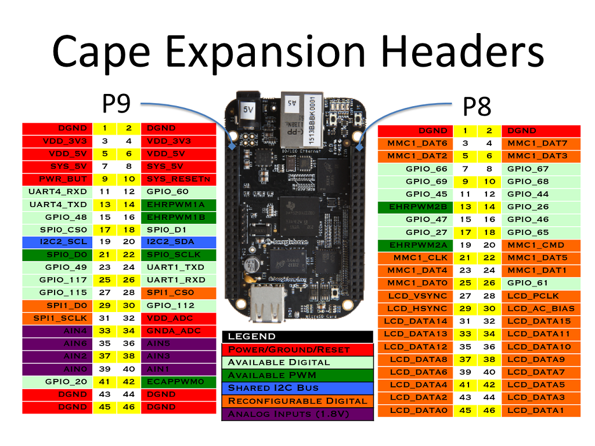

# Tutorial 1

Tutorial on how to access and cross compile for the beaglebone

## Accessing the BeagleBone

Use the provided USB cable to connect the beaglebone to the host computer (i.e. your laptop). You should see the blue LEDs start flashing - that indicates the beaglebone is booting up. Eventually flashing should reach a 'heart beat' pattern, which means the beagle is done booting.

For Mac or Linux users, the beaglebone should be avaible at the IP `192.168.6.2`. For Windows users the IP is `192.168.7.2`. To check the connection you can try pinging the addresses.

``` MacOS/Linux
ping 192.168.6.2
```

``` Windows
ping 192.168.7.2
```

We'll use Secure Shell protocol (SSH) to execute commands from the command line on the beaglebone and Secure Copy Protocol (SCP) to copy files from the host computer to the laptop.

With SSH, you need to first remote login into the beaglebone. By default the username is `debian`.

``` MacOS/Linux
ssh debian@192.168.6.2
```

``` Windows
ssh debian@192.168.7.2
```

You should be prompted to enter the password. This should allow you current terminal to access the beaglebone. 

To copy files from the host computer to the beagle bone user the `scp` command:

```
scp <local file address to copy> <username>@<remote ip>:<destiation>
```

Example:

``` MacOS/Linux
scp test.txt debian@192.168.6.2:~/test_copy.txt
```

This copies the local file `test.txt` to the file `~/test_copy.txt` in the beaglebone.

Finally, to close the connection:

``` BeagleBone
exit
```
## LED Circuit
The main feature of the beaglebone black is its extensive pin I/O, found in the P8 and P9 headers. This section will demonstrate a simple way to control GPIO (general purpose IO) pins via the Linux file system.



Connect the p9.41 pin (a.k.a. gpio20 pin) to the resistor. Connect the resistor to the LED's anode (the longer leg). Connect the LED's cathode (shorter end) to the p9.1 (a.k.a the DGND pin).


To set up the gpio20 pin run the following command:
```
echo 20 > /sys/class/gpio/export
```

Then set the gpio20 pin's direction to out.
```
echo "out" > /sys/class/gpio/gpio20/direction
```

Now the voltage of the gpio20 pin can be controlled by writing its value.
```
echo 1 > /sys/class/gpio/gpio20/value
echo 0 > /sys/class/gpio/gpio20/value
```


## Cross Compiling

In the `/src` and `/include` folders you'll find some short c++ code used to blink and LED 10 times on the beaglebone using sysfs.

We can compile this code natively, but its very likely the generated executable will not work on the beaglebone.

To cross compile we need to set up a build enviornment with the necessary tools to compile specifically for the beaglebone's architecture. There are many ways to do this and in this tutorial we'll use docker to do so. 

`Dockerfile` is a file with all of the commands Docker uses to create an image (you can think of it like a template). It starts with a base debian image and then installs additional tools such as cmake and an arm-linux compiler.

We can build an image with the following command:

```
docker compose build
```